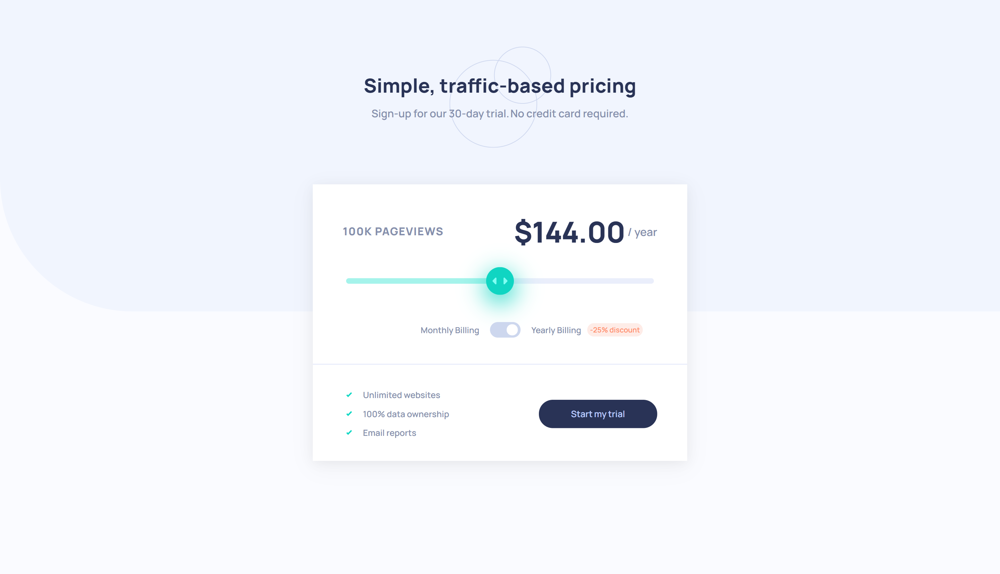
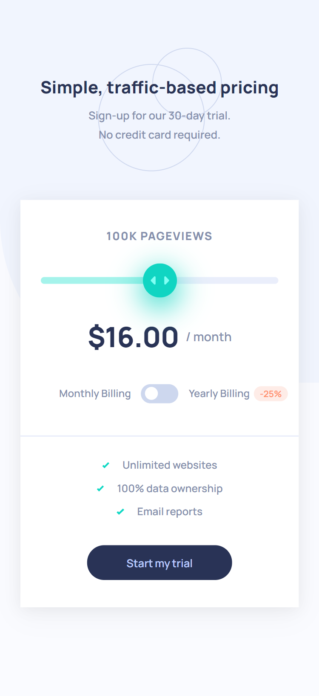
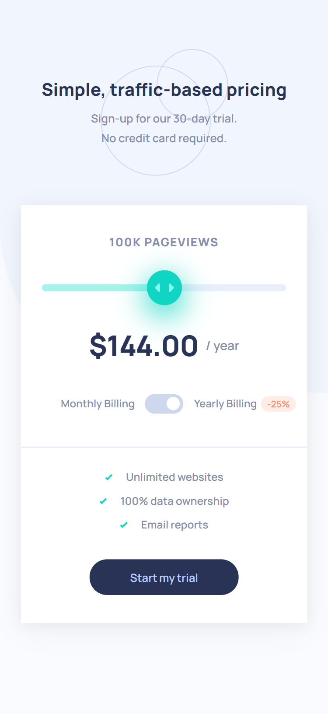

# Frontend Mentor - Interactive pricing component solution

This is a solution to the [Interactive pricing component challenge on Frontend Mentor](https://www.frontendmentor.io/challenges/interactive-pricing-component-t0m8PIyY8).

Frontend Mentor challenges help you improve your coding skills by building realistic projects.

## Table of contents

- [Frontend Mentor - Interactive pricing component solution](#frontend-mentor---interactive-pricing-component-solution)
  - [Table of contents](#table-of-contents)
  - [Overview](#overview)
    - [The challenge](#the-challenge)
    - [Screenshot](#screenshot)
    - [Links](#links)
  - [My process](#my-process)
    - [Built with](#built-with)
  - [Author](#author)

## Overview

### The challenge

Users should be able to:

- View the optimal layout for the app depending on their device's screen size
- See hover states for all interactive elements on the page
- Use the slider and toggle to see prices for different page view numbers

### Screenshot

Desktop:

|  |  |
| :-----------------------------------------------------: | :-----------------------------------------------------: |

Mobile:

|  |  |
| :---------------------------------------------------: | :---------------------------------------------------: |

### Links

- [Live Demo](https://wess-mhhw.github.io/interactive-pricing-component/)

## My process

### Built with

- Semantic HTML5 markup
- CSS custom properties
- Flexbox
- CSS Grid
- Javascript

## Author

- Frontend Mentor - [@wess-MHHW](https://www.frontendmentor.io/profile/wess-MHHW)
- LeetCode - [@wess-MHHW](https://leetcode.com/wess-MHHW/)
- Linkedin - [@wassim-maaoui](https://www.linkedin.com/in/wassim-maaoui/)
